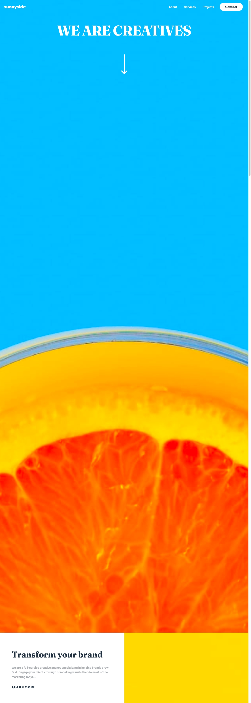

# Frontend Mentor - Sunnyside agency landing page solution

This is a solution to the [Sunnyside agency landing page challenge on Frontend Mentor](https://www.frontendmentor.io/challenges/sunnyside-agency-landing-page-7yVs3B6ef). Frontend Mentor challenges help you improve your coding skills by building realistic projects.

## Table of contents

- [Overview](#overview)
  - [The challenge](#the-challenge)
  - [Screenshot](#screenshot)
  - [Links](#links)
- [My process](#my-process)
  - [Built with](#built-with)
  - [What I learned](#what-i-learned)
  - [Continued development](#continued-development)
  - [Useful resources](#useful-resources)
- [Author](#author)

**Note: Delete this note and update the table of contents based on what sections you keep.**

## Overview

### The challenge

Users should be able to:

- View the optimal layout for the site depending on their device's screen size
- See hover states for all interactive elements on the page

### Screenshot

- Desktop :;

- Ipad :

- Mobile :;

**Note: Delete this note and the paragraphs above when you add your screenshot. If you prefer not to add a screenshot, feel free to remove this entire section.**

### Links

- Solution URL: [Github REpo](https://github.com/codeAndcocoa/Sunnyside-agency-landing-page.git)
- Live Site URL: [Live site](https://codeandcocoa.github.io/Sunnyside-agency-landing-page/)

## My process

### Built with

- Semantic HTML5 markup
- CSS custom properties
- Flexbox
- CSS Grid
- Bootstrap 5
- Vanilla javascript

## Author
- Website - [Github profile](https://github.com/codeAndcocoa)
- Frontend Mentor - [@codeAndcocoa](https://www.frontendmentor.io/profile/codeAndcocoa)

